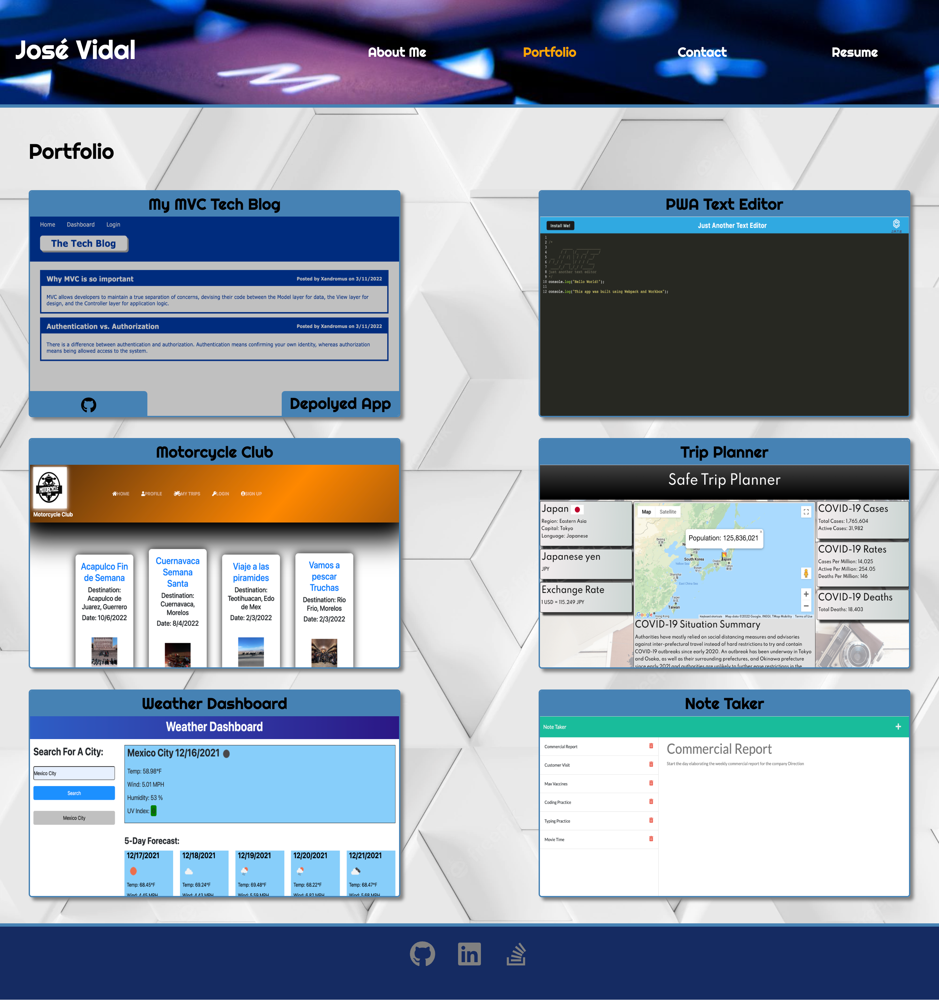
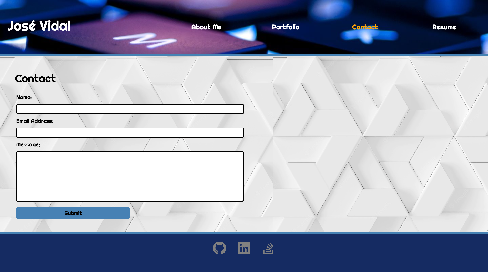
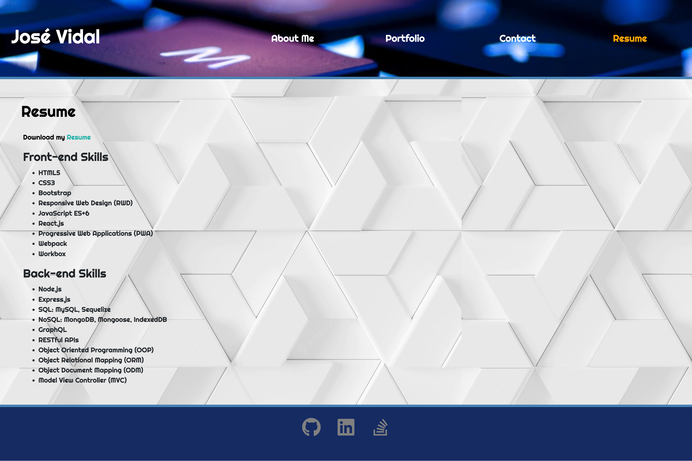

# jvma-apps-portfolio
This application is my personal portfolio, containing information about me, my work, a contact form, skills and my downloadable resume. It was built using React.js.

## Description

This was a Job-Seeking coding assessment, where I was required to build my personal portfolio using React.js. The website is a single-page application with Header and Footer components, both appearing on multiple pages. The Header contains my name and a Navigation component, with 4 links to the following sections: "About Me", "Portfolio", "Contact" and "Resume". The About Me component contains my photo and a short bio. In the Portfolio component the viewer can find titled images of my most recent applications, with links to their corresponding GitHub repository and deployed URL. Then, the Contact component displays a form where the user can enter Name, Email Address and a Message to communicate with me. The Resume component contains a list of Front-end and Back-end skills as well as my downloadable Resume in PDF format. Last but not least, the Footer component has links to my GitHub, LinkedIn and Stack Overflow profiles. The application was built following a mobile-first design, using media queries and Bootstrap for Responsive Web Design. 

To begin, first I created the React App using `npx create-react-app` command in the Terminal, to get the set up for the file structure. Once that was done, I installed the npm packages for Bootstrap, gh-pages and react-icons. The next task was adding the "homepage" as well as the "predeploy" and "deploy" scripts to the package.json. After that, I created the components and pages directories, and inside of them I created the files for the different components that the application would use: Header.js, Navigation.js, PortfolioContainer.js, Footer.js, AboutMe.js, Portfolio.js, Project.js, Contact.js and Resume.js. Later on, I also created a file named projectData.js, where I defined an array of objects with all the information for each of the projects that would be rendered in the Portfolio component. I also created the utils directory with a helpers.js file, which contains a `validateEmail()` function, used later in contact.js to check that the user input for the Email Address field is a valid email.   

With the file structure done, first I imported all the necessary modules and files for each component. Then, in index.js I used `ReactDOM.createRoot()` to render the `<App />` component. For App.js I just returned the `<PortfolioContainer />` component. Next, in PortfolioContainer.js I defined the `currentPage` variable, with the default state being `'AboutMe'`, I wrote a `renderPage()` function with a set of `if` statements to render a specific component depending on the state of `currentPage`. I also defined a `handlePageChange(pages)` function, calls the `setCurrentPage(page)` function and returns a `
` with `<Header currentPage={currentPage} handlePageChange={handlePageChange}/>`, `{renderPage()}` and `<Footer />`. I did a little bit of prop drilling to pass the `currentPage` and `handlePageChange` props to Header.js and Navigation.js.

Next, I wrote the code in Header.js, Navigation.js, Resume.js and Footer.js, with basic functions that render the necessary HTML elements and components for each of these sections. Then I worked on the code in Contact.js, first defining `name`, `email`, `message` and `requiredField` variables, all with empty default states. Following this, I defined 3 functions, `handleInputChange(event)` to change the empty states of `name`, `email` and `message` to the input provided by the user, `handleOnBlurInput(event)` to display messages for missing information or invalid email address from the user (it works with the `onBlur` react Form attribute), `handleFormSubmit(event)` to show messages if the user tries to submit the Form with missing information or an invalid Email address. 

Then, for the Portfolio component, first I wrote the code in Project.js where I used the `map()` method to perform a function on each of the objects in the array of the variable defined as `projectData` in the projectData.js file. Each object is a project of mine, and contains basic information like id, title, github link, deployed link and image. The function then returns a `
` element per project, rendering an titled image along with links to the GitHub repo and deployed application of each project.

Finally, after all the components where built and working as expected, I created index.css and App.css files, adding code for all the css properties to give style to the application (with a mobile-first design approach). I also added Bootstrap classes for layout and set up several media queries for Responsive Web Design.

## Usage & [Deployed Application](https://josevidmal.github.io/jvma-apps-portfolio/)

This is the link to the deployed application with GitHub Pages: https://josevidmal.github.io/jvma-apps-portfolio/

The application looks like this:

## Technologies Used

* React.js
* JSX
* JavaScript
* Node.js
* NPM
* HTML
* CSS
* Bootstrap
* Google Fonts
* React-icons package
* Gh-pages package

## Contact Information

* GitHub Profile: [josevidmal](https://github.com/josevidmal)
* email: josevidmal@gmail.com

## License

[The MIT License](https://www.mit.edu/~amini/LICENSE.md)

Copyright 2022 Jose Vidal

Permission is hereby granted, free of charge, to any person obtaining a copy of this software and associated documentation files (the "Software"), to deal in the Software without restriction, including without limitation the rights to use, copy, modify, merge, publish, distribute, sublicense, and/or sell copies of the Software, and to permit persons to whom the Software is furnished to do so, subject to the following conditions:
    
The above copyright notice and this permission notice shall be included in all copies or substantial portions of the Software.
    
THE SOFTWARE IS PROVIDED "AS IS", WITHOUT WARRANTY OF ANY KIND, EXPRESS OR IMPLIED, INCLUDING BUT NOT LIMITED TO THE WARRANTIES OF MERCHANTABILITY, FITNESS FOR A PARTICULAR PURPOSE AND NONINFRINGEMENT. IN NO EVENT SHALL THE AUTHORS OR COPYRIGHT HOLDERS BE LIABLE FOR ANY CLAIM, DAMAGES OR OTHER LIABILITY, WHETHER IN AN ACTION OF CONTRACT, TORT OR OTHERWISE, ARISING FROM, OUT OF OR IN CONNECTION WITH THE SOFTWARE OR THE USE OR OTHER DEALINGS IN THE SOFTWARE.